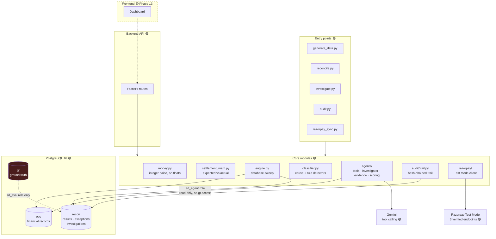

# 🔎 Settlement Detective

### AI-Powered Settlement Exception Investigator

> **Don't just find the mismatch. Find out why.**

Settlement Detective reconciles merchant payment settlements deterministically,
detects exceptions, and deploys an AI investigator **only** on the cases rules
cannot close. It explains what it can evidence, escalates what it cannot, and
records every step in a tamper-evident audit trail.


| | |
|---|---|
| Live demo | 🟡 TODO — no deployment (submission asks for a public repo, not a URL) |
| Demo video | 🟡 TODO — Phase 16 |
| Architecture | [below](#-architecture) |

---

## 🚀 What it is

A merchant takes thousands of payments. Those payments eventually arrive as
settlement batches in a bank account. Most reconcile. Some don't.

Traditional reconciliation says **"something doesn't match."**
Settlement Detective tries to answer **"why doesn't it match?"** — by tracing:

```
Payment → Order → Refund → Fee → Tax → Adjustment → Settlement
```

The goal is to cut manual investigation effort **without** letting a language
model make financial decisions it cannot evidence.

---

## 💰 The problem

A merchant expects **₹4,500**. The settlement contains **₹4,100**. Where did
₹400 go?

It could be a refund, a fee, tax on that fee, an adjustment, a partial
settlement, a duplicate charge, a timing difference — or nothing anyone can
find. Each possibility means opening a different record.

One case is a few minutes. A few hundred a month is a job. The costs are
operational rather than dramatic:

- finance-team time spent on repetitive record-tracing
- reconciliation closing later than it should
- exceptions resolved by assumption when the real cause isn't found
- no consistent trail explaining *why* a case was closed

> No monetary savings are claimed anywhere in this project. Nothing has been
> measured against a real finance team.

---

## 🧠 The core idea

```
Traditional                    Settlement Detective
───────────                    ────────────────────
Records                        Records
  ↓                              ↓ deterministic reconciliation
Match                            ↓ exception detection + classification
  ↓                              ↓ AI investigation (controlled tools)
Mismatch                         ↓ evidence retrieval + verification
  ↓                              ↓ code-computed confidence
Human investigates               ↓ resolve / review / escalate
                                 ↓ audit trail
```

This is deliberately **not** `input → LLM → answer`. The LLM never sees the
database, never performs arithmetic, and never closes a case on its own say-so.

---

## 🏗️ Architecture



**The red box matters:** ground truth lives in its own schema, and the database
role the AI connects as has **no grant on it**. A leak is a `permission denied`
at runtime, not a code-review miss.

---

## 🤖 Where AI is used — and where it isn't

| Job | Owner |
|---|---|
| Choosing which records to look at | 🤖 LLM |
| Reasoning across related records | 🤖 LLM |
| Deciding a cause and writing the explanation | 🤖 LLM |
| Judging when evidence is insufficient | 🤖 LLM |
| **Every monetary calculation** | ⚙️ Code |
| **What each record actually contains** | ⚙️ Code |
| **Whether the evidence closes the discrepancy** | ⚙️ Code |
| **Whether the case resolves or escalates** | ⚙️ Code |

```
Exception detected
   ↓
Agent reads the case through tools (sd_agent role, read-only)
   ↓
Selects further tools only if the records don't explain the gap
   ↓
Submits a finding: cause + cited records + claimed amounts
   ↓
Code verifies every citation against the real record
   ↓
Code computes the residual and the evidence score
   ↓
RESOLVED (≥90) · REVIEW (60–89) · ESCALATED (<60)
   ↓
Hash-chained audit trail
```

### The tools 🟢

The agent has **no arbitrary SQL and no database access** — only these:

| Tool | What it returns | Why it exists |
|---|---|---|
| `get_case_bundle` | payment + order + fee + refunds + adjustments + settlement lines + expected/actual/delta | One call answers most cases; six round-trips would exhaust a free-tier quota |
| `calculate_expected_settlement` | the expectation, recomputed by the audited engine | So the model never does arithmetic |
| `find_related_transactions` | sibling payments on the same order, all refunds on it | Finds duplicate charges and cross-payment refunds |
| `search_batch_adjustments` | every adjustment in a batch, **including unlinked ones** | Deductions booked to the batch with no `payment_id` |
| `get_settlement` | a batch, its lines, and whether it was actually paid out | A line in a `created` batch is money scheduled, not received |
| `submit_finding` | *(terminal)* cause, cited evidence, unresolved flag | Ends the investigation |

Tool arguments are pattern-validated before execution; unknown tools and stray
arguments are refused and returned to the model as data, never as a crash.

---

## 💵 Financial model 🟢

**Settlement is a batch with line items**, not one row per payment:

```
Settlement Batch (setl_…)  →  net_amount, utr, status
├── PAYMENT line     credit − fee − tax
├── REFUND line      −amount
└── ADJUSTMENT line  ±amount (signed in the data)
```

```
EXPECTED_NET = gross − fee − tax − refunds + adjustments
ACTUAL_NET   = Σ settlement lines from batches that were actually paid out
DELTA        = ACTUAL_NET − EXPECTED_NET
```

- **All money is integer paise.** `float` is rejected at every boundary and a
  static AST check over ten financial modules fails the build if one appears.
- Rounding is `ROUND_HALF_UP` at a **single site**.
- Per-payment tolerance is configurable (default 1 paise). **Batch-level
  reconciliation uses zero tolerance** — a payout *is* the sum of its lines.
- Refunds and adjustments settle on their **own** T+2 cycle, so each is counted
  only once its own eligibility date has passed.
- Fee/GST are **not** reversed on refund (configurable; changes every refunded
  payment's expectation).

---

## 🗃️ Data model 🟢

**`ops`** — financial records (agent may read)

| Entity | Purpose |
|---|---|
| `customers` | merchant's customers |
| `orders` | what was bought |
| `payments` | captured / failed / refunded charges |
| `refunds` | money returned, with `processed_at` |
| `fees` | processing fee + GST per payment, and the rate applied |
| `adjustments` | signed corrections; `payment_id` **nullable** by design |
| `settlements` | the batch: `net_amount`, `utr`, `status`, date |
| `settlement_items` | one line per payment / refund / adjustment |

**`recon`** — results and audit

| Entity | Purpose |
|---|---|
| `recon_runs` | one sweep, with the full config snapshot it used |
| `recon_results` | per-payment expected / actual / delta / status |
| `exceptions` | detected discrepancies, typed and scored |
| `investigations` | one attempt, with score factors and records examined |
| `investigation_steps` | every tool call, hash-chained (append-only) |
| `evidence` | cited records, supporting **and** rejected |

**`gt`** — `case_truth`. Injected cause and amount. Readable by `sd_eval` only.

---

## 🔍 Exception taxonomy 🟢

All ten are implemented, injected, detected and classified.

| Exception | Meaning | Found by |
|---|---|---|
| `MISSING_SETTLEMENT` | captured, past its cycle, never paid out | arithmetic |
| `MISSING_REFUND` | refund due but never debited | arithmetic |
| `INCORRECT_REFUND_AMOUNT` | settled refund ≠ recorded refund | arithmetic |
| `FEE_MISMATCH` | fee deducted ≠ fee recorded | arithmetic |
| `TAX_MISMATCH` | GST at the wrong rate | arithmetic |
| `PARTIAL_SETTLEMENT` | part paid, remainder in an unprocessed batch | arithmetic |
| `UNKNOWN_DISCREPANCY` | money missing, nothing explains it | arithmetic |
| `DUPLICATE_PAYMENT` | same order charged twice | **rule** |
| `SETTLEMENT_TIMING` | right amount, arrived late | **rule** |
| `UNEXPECTED_ADJUSTMENT` | deduction with no reason recorded | **rule** |

> Three of these **reconcile perfectly** — the money adds up, it simply should
> not have moved, or moved late. Arithmetic is structurally blind to them,
> which is why rule detectors exist. A test asserts the arithmetic misses them,
> so the baseline cannot be quietly flattered.

Plus three injected **difficulty families** that exist to separate rule-matching
from real reasoning: `MULTI_CAUSE` (two faults in one delta), `CROSS_ENTITY`
(explanation reachable only via the batch), `TIMING_SHIFTED` (looks like a
missing refund until you check batch status).

---

## 🧪 Synthetic data 🟢

A FreshKart (fictional online grocer) dataset, currently loaded:

| | |
|---|---|
| Payments | **10,055** |
| Settlement lines | 10,167 |
| Settlement batches | 181 |
| Injected exceptions | **700** (7%) |

Realistic by design: UPI-dominant method mix, grocery basket sizes, 4% payment
failures, 9% refunds, 90 days of history. Every rate is basis points — no
probability is a float. Same seed → identical dataset.

**The generator verifies itself before writing.** A clean world must reconcile
at 100%, and the loader **refuses to persist** one that doesn't. It also
cross-checks that every delta-visible injection is detected and that no
exception appears which wasn't injected.

**Ground truth** (`gt.case_truth`) records what was broken and by how much. The
agent's database role has no grant on that schema. `UNKNOWN_DISCREPANCY` cases
carry **no** explanation on purpose — if they did, an honest "I don't know"
would score as failure and the system would learn to guess.

---

## 🧩 Example investigation

**Explained** — ₹1,000 card payment, ₹400 refunded:

```
gross 1000.00 − fee 20.00 − GST 3.60 − refund 400.00 = expected ₹576.40
actual ₹576.40                                          delta ₹0.00   ✅
```

**Unresolved** — a real case from a live run:

```
delta +₹13,571.00
agent: get_case_bundle → find_related_transactions → get_settlement
finding: UNKNOWN_DISCREPANCY, unresolved
evidence score 0  →  ESCALATED, full ₹13,571 still flagged
model claimed 100% certainty; the decision ignored that number
```

That last line is the point: **the model's own confidence never decides
anything.**

---

## 🛡️ Financial safety 🟢

> **In financial operations, "I don't know" is better than a confident wrong answer.**

Guardrails, all implemented and tested:

| Guard | How it's enforced |
|---|---|
| Agent cannot read ground truth | no database grant on `gt` → `permission denied` |
| Agent cannot modify money | `SELECT` only on `ops` |
| Agent cannot rewrite its own trail | `INSERT`, no `UPDATE`/`DELETE` on steps |
| No arbitrary SQL | six whitelisted tools, arguments pattern-validated |
| No invented records | every citation checked to exist |
| **No invented amounts** | every citation checked against what the record *can* support |
| **A record can't explain itself** | citing the payment under investigation is refused |
| Residual is computed, not claimed | `unexplained = delta − Σ verified evidence` |
| "Resolved as unknown" | refused as a contradiction |
| Declaring unresolved | keeps the **full** discrepancy open |
| LLM outage / budget exhausted | escalate — never guess |

The strongest of these came from a real failure: the model once cited *the
payment under investigation* for the entire delta, driving the residual to zero
and producing a confident `RESOLVED` while explaining nothing. That path is now
closed, with tests holding it shut.

---

## 📋 Audit trail 🟢

```
Investigation → exception → every tool call (args + results + timings)
             → records examined → evidence (accepted and rejected, with reasons)
             → score factors → decision → integrity check
```

**Hash chain:** each step commits to the one before it. Demonstrated live — an
owner editing step 2 is caught at seq 2; deleting it is caught at seq 3.

> **Tamper evidence, not tamper proofing.** Someone who rewrites every hash from
> the tampered step onward would pass. Defeating that needs the chain head
> anchored outside this database — a production concern, not pretended at here.

`python scripts/audit.py --latest` reconstructs any investigation from the
database alone. `--verify-all` checks every stored trail.

---

## 🔌 Backend API 🟢

FastAPI over the existing modules — it owns no financial logic, serving what the
engine, classifier, investigator and audit trail already produced. Interactive
docs at **`/docs`**.

| Method | Endpoint | Purpose |
|---|---|---|
| `GET` | `/api/health` | dataset + latest run |
| `GET` | `/api/runs` · `/api/runs/latest` | Command Centre totals |
| `GET` | `/api/exceptions` | queue, with filters and pagination |
| `GET` | `/api/exceptions/{id}` | detail + timeline + evidence + chain integrity |
| `POST` | `/api/exceptions/{id}/investigate` | run the agent on one case |
| `GET` | `/api/metrics` | evaluation aggregates |

Three lines held, each asserted by test:

- **Ground truth is aggregates-only.** `/api/metrics` reads `gt` through the
  `sd_eval` role to produce counts; no route returns a per-case answer key.
- **Exactly one non-GET route exists.** The API is an investigation surface, not
  a way to edit money.
- **The agent gets no wider access over HTTP** — same least-privilege
  connection as the CLI, and the owner still writes back the case status.

An already-investigated case returns the stored result unless `force=true`, so a
dashboard refresh cannot spend API quota. Money crosses the wire as
`{paise, display}` — never a float.

```bash
./.venv/bin/python scripts/serve.py            # http://localhost:8000/docs
./.venv/bin/python scripts/serve.py --port 8001
```

---

## 📊 Evaluation

### Measured 🟢 — deterministic pipeline, 10,055 payments

| Metric | Result |
|---|---:|
| Reconciled (matched + legitimately pending) | 94.35% |
| Exception detection precision | **100.00%** (0 false positives) |
| Exception detection recall | **100.00%** (700 / 700) |
| Classification accuracy, where one correct type exists | **100.00%** (633 / 633) |
| Classification accuracy, over all injected | 90.43% |
| Batch-level imbalances | **0** of 181 |
| Throughput | 10,055 payments in **0.40 s** |

> **Read 90.43% as an upper bound.** These rules were written knowing which
> faults the injectors create. Phase 15 must throw unseen variants at them, or
> the number is measuring memorisation.

### Not yet measured 🟡 — AI investigation, Phase 14

The agent has been **smoke-tested on 5 cases**, not evaluated. Those runs are
not a result and are not reported as one.

| Metric | Result |
|---|---:|
| Investigation accuracy | TBD |
| Correct resolution rate | TBD |
| **False resolution rate** | TBD |
| Escalation rate | TBD |
| Investigation latency | TBD |
| Human hours saved | TBD *(requires a stated manual-time assumption)* |

False resolution rate is the headline metric, not accuracy: 95% resolved with
4% false resolutions is worse than 70% resolved with 0.2%.

---

## 🆚 Baseline vs Settlement Detective

The baseline is **deliberately strong** — a weak one would make the comparison
worthless, and a judge would see through it.

| | Baseline 🟢 | + AI 🟠 |
|---|---|---|
| Reconciliation | deterministic | same |
| Detection | 700/700, 100% precision | same |
| Classification | 633/633 single-cause | + multi-cause decomposition |
| `MULTI_CAUSE` (67 cases) | **declines — no single cause matches** | the actual headroom |
| Output | a label | a cited, verifiable narrative |
| Unseen fault shapes | rules are brittle | to be tested (Phase 15) |

The AI's quantitative headroom is narrow and stated plainly: **67 cases**, plus
evidence quality and escalation judgement.

---

## 🖥️ Product UI — 🟡 Planned (Phase 13)

No frontend exists. No screenshots exist.

1. **Command Center** — totals, match rate, resolution rate
2. **Exception Queue** — the table and its filters
3. **Investigation View** — timeline and real tool calls *(the key screen)*
4. **Evidence View** — every record and the exact calculation
5. **Analytics** — precision, recall, false resolution rate, throughput

---

## 🎬 Demo flow — 🟡 Planned (Phase 16)

Load 10,000 records → reconcile → show matched vs exceptions → open one
exception → run the agent → show tool calls, evidence and the deterministic
calculation → resolve a high-confidence case → open an unknown discrepancy →
show insufficient evidence → escalate → show metrics.

**The demo makes zero live API calls.** Every investigation is replayed from
the stored audit trail, so it cannot break on venue wifi or a rate limit.

---

## 🧰 Tech stack

| Layer | Technology |
|---|---|
| Language | Python 3.13 |
| Database | PostgreSQL 16 (three schemas, three least-privilege roles) |
| ORM / migrations | SQLAlchemy 2.0 · Alembic (7 migrations) |
| AI | Gemini `gemini-3.5-flash-lite`, tool calling — provider is pluggable |
| HTTP | httpx (forced IPv4, split connect/read timeouts) |
| Testing | pytest · hypothesis (property-based) |
| Infrastructure | Docker Compose |
| Payment integration | Razorpay **Test Mode**, 3 verified endpoints |
| Backend API | FastAPI + uvicorn 🟢 |
| Frontend | 🟡 Next.js — Phase 13 |

---

## 📁 Project structure

```
Settlement-Detective/
├── backend/
│   ├── money.py              integer paise; the only rounding site
│   ├── config.py             every number that changes a financial outcome
│   ├── enums.py              controlled vocabularies
│   ├── reconciliation/       fees · timing · settlement_math · guards
│   │                         engine.py · classifier.py
│   ├── generation/           profile · generator · exceptions · verify · persist
│   ├── agents/               llm · tools · prompts · investigator
│   │                         evidence · scoring
│   ├── audit/trail.py        hash chain + reconstruction
│   ├── razorpay/             Test Mode client + mapping
│   ├── models/               ops · recon · gt
│   └── db/session.py         one engine per database role
├── alembic/versions/         0001 … 0007
├── scripts/                  verify_model · generate_data · reconcile
│                             investigate · audit · razorpay_sync
├── tests/                    test_g1 … test_g15 (278 passing)
├── docs/                     PLAN.md · ASSUMPTIONS.md
├── docker-compose.yml
└── .env.example
```

---

## 🚀 Getting started

**Prerequisites:** Docker, Python 3.13.

```bash
git clone https://github.com/anirudhg-07/Settlement-Detective.git
cd Settlement-Detective
cp .env.example .env          # then fill in the passwords and LLM_API_KEY

docker compose up -d          # PostgreSQL 16 on :55432

python3 -m venv .venv
./.venv/bin/pip install -r requirements.txt
./.venv/bin/alembic upgrade head
```

Then:

```bash
./.venv/bin/pytest -q                                       # 278 tests
./.venv/bin/python scripts/verify_model.py                  # worked examples
./.venv/bin/python scripts/generate_data.py --count 10000   # generate + load
./.venv/bin/python scripts/reconcile.py                     # reconcile + score
./.venv/bin/python scripts/investigate.py --limit 5 --show  # AI agent
./.venv/bin/python scripts/audit.py --latest                # audit trail
./.venv/bin/python scripts/razorpay_sync.py                 # Razorpay Test Mode
```

> `scripts/investigate.py` is checkpointed, response-cached and request-budgeted,
> so an interrupted run resumes rather than re-spending API quota.

---

## 🔐 Environment variables

From `.env.example` — no secret is ever committed (verified across all history).

| Variable | Purpose |
|---|---|
| `DATABASE_URL` | owner role — migrations, generation, reconciliation |
| `AGENT_DATABASE_URL` · `SD_AGENT_PASSWORD` | least-privilege role for the AI tools — **no grant on `gt`** |
| `EVAL_DATABASE_URL` · `SD_EVAL_PASSWORD` | the only role that may read ground truth |
| `TOLERANCE_PAISE`, `GST_RATE_BPS`, `FEE_RATE_BPS_*` | financial parameters |
| `SETTLEMENT_CYCLE_DAYS`, `SETTLEMENT_GRACE_DAYS`, `AS_OF_DATE` | timing |
| `REVERSE_FEE_ON_REFUND` | whether fee/GST are credited back on refund |
| `EVIDENCE_AUTO_RESOLVE`, `EVIDENCE_REVIEW_MIN` | confidence thresholds (90 / 60) |
| `LLM_PROVIDER`, `LLM_MODEL`, `LLM_API_KEY`, `LLM_RPM`, `LLM_MAX_TOOL_CALLS` | agent |
| `RAZORPAY_KEY_ID`, `RAZORPAY_KEY_SECRET` | **Test Mode only** — a live key is refused |

All secret-key operations happen server-side. `.env` is gitignored;
`.env.example` carries blank placeholders only.

---

## 🧪 Testing

**257 passing, 1 skipped.** `./.venv/bin/pytest -q`

| Suite | Covers |
|---|---|
| `test_g1` – `g3` | money primitives, fee/GST, expected settlement |
| `test_g4` | sign convention + **property-based conservation invariants** |
| `test_g5` | tolerance boundaries, settlement timing, determinism |
| `test_g6` | write guards, database triggers, role permissions |
| `test_g7` – `g8` | generator, exception injection, ground truth |
| `test_g9` – `g10` | reconciliation engine, classification, rule detectors |
| `test_g11` | agent loop, failure modes, tool validation |
| `test_g12` | **evidence verification — the false-resolution guards** |
| `test_g13` | confidence scoring and its separation from the model |
| `test_g14` | audit trail, hash chain, tamper detection |
| `test_g15` | Razorpay mapping and cross-validation |

Two structural checks worth noting: an AST scan fails the build if `float`
appears in any financial module, and another fails if reconciliation code reads
the wall clock instead of `as_of_date`.

---

## 🗺️ Roadmap

| Phase | | Status |
|---|---|---|
| 1 | Financial model + specification | 🟢 |
| 2 | Database schema + financial primitives | 🟢 |
| 3 | Synthetic data generator | 🟢 |
| 4 | Exception injection + ground truth | 🟢 |
| 5 | Deterministic reconciliation engine | 🟢 |
| 6 | Exception classification | 🟢 |
| 7 | AI investigation agent | 🟢 |
| 8 | Evidence builder | 🟢 |
| 9 | Confidence / safety layer | 🟢 |
| 10 | Audit trail | 🟢 |
| 11 | Razorpay Test Mode integration | 🟢 |
| 12 | Backend APIs | 🟢 |
| 13 | Frontend dashboard | 🟡 |
| 14 | Evaluation | 🟡 |
| 15 | Stress testing | 🟡 |
| 16 | Demo, polish, documentation | 🟡 |

---

## 📌 Current status

**Track:** Razorpay AI Buildathon — AI Finance Controller
**Phase:** 13 — Frontend dashboard

| Component | Status |
|---|---|
| Financial model | 🟢 implemented, property-tested |
| Database (3 schemas, 3 roles, 7 migrations) | 🟢 |
| Synthetic data (10,055 payments, 700 exceptions) | 🟢 loaded |
| Reconciliation engine | 🟢 100% precision, 100% recall |
| Exception classification | 🟢 633/633 where one correct type exists |
| AI investigator | 🟠 working, smoke-tested on 5 cases |
| Evidence verification | 🟢 |
| Confidence scoring | 🟢 |
| Audit trail + tamper detection | 🟢 |
| Backend APIs | 🟢 6 endpoints, OpenAPI at `/docs` |
| Frontend | 🟡 |
| Evaluation at scale | 🟡 |
| Razorpay Test Mode | 🟢 authenticated; returns no settlements, as expected |

---

## 🎯 Why Razorpay

Settlement reconciliation is core payment-infrastructure work: batches, line
items, fees, GST, refunds and adjustments are exactly what a gateway produces
and exactly what a merchant's finance team has to explain.

Three Phase 1 modelling decisions — made from first principles, before the
Razorpay API was read — turned out to match it exactly:

| Our choice | Razorpay's API |
|---|---|
| Integer paise | amounts in "currency subunits" |
| Batch **+ line items**, not one row per payment | that *is* the recon report |
| Status `created` / `processed` / `failed` | the same three values |

Our own `payment_item_net`, run over the gross and deductions from Razorpay's
documented example, reproduces the net **they** credited — asserted in tests.

> This is an independent prototype inspired by how settlement operations work.
> It is not a Razorpay product, and it uses no internal systems or data.
> Test Mode returns no settlements (money never actually moves), which is why
> the synthetic dataset is the evaluation environment.

---

## 🚀 Production vision

```
Synthetic data → controlled test data → live settlement feeds
→ merchant-specific fee and cycle rules → human review queue
→ production monitoring → continuous exception investigation
```

Everything past "controlled test data" is future work. A production deployment
would additionally need the audit chain head anchored outside the database,
per-merchant fee schedules verified against contracts, and a real
human-in-the-loop review workflow.

---

## 🏆 Why this isn't an AI wrapper

The LLM cannot reach the database, cannot do arithmetic, cannot see the answers
it is graded against, cannot edit its own audit trail, and cannot close a case.

```
Financial records → deterministic reconciliation → exception detection
→ AI tool selection → evidence retrieval → reasoning across records
→ deterministic verification of every cited amount → computed confidence
→ resolve / review / escalate → hash-chained audit trail
```

Remove the LLM and the system still detects and classifies 700 of 700
exceptions. The AI is there for the cases where **rules genuinely run out** —
and it is fenced so that when it is wrong, the system escalates instead of
believing it.

---

## 👨‍💻 Author

**Anirudh** — [github.com/anirudhg-07](https://github.com/anirudhg-07)
Repository: [Settlement-Detective](https://github.com/anirudhg-07/Settlement-Detective)

## 📚 Documentation

- [docs/PLAN.md](PLAN.md) — phase-by-phase build log, including bugs found
- [docs/ASSUMPTIONS.md](ASSUMPTIONS.md) — every assumption that changes a number
