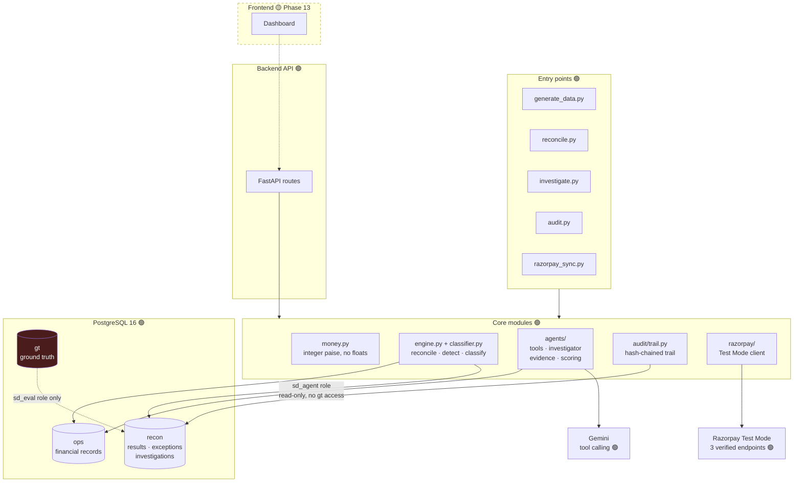

# 🔎 Settlement Detective

### AI-Powered Settlement Exception Investigator

> **Don't just find the mismatch. Find out why.**

Reconciles merchant settlements deterministically, detects exceptions, and
deploys an AI investigator **only** on the cases rules cannot close. It explains
what it can evidence, escalates what it cannot, and records every step in a
tamper-evident audit trail.


*Demo video and deployment: 🟡 TODO (Phase 16 — submission asks for a public repo, not a URL).*

---

## 🚀 The problem

A merchant expects **₹4,500**. The settlement contains **₹4,100**. Where did
₹400 go — a refund, a fee, GST, an adjustment, a partial settlement, a duplicate
charge, a timing difference, or nothing anyone can find?

Each answer means opening a different record. One case is minutes; a few hundred
a month is a job. Traditional reconciliation says *"something doesn't match."*
Settlement Detective tries to answer *"why doesn't it match?"* — by tracing:

```
Payment → Order → Refund → Fee → Tax → Adjustment → Settlement
```

The costs are operational, not dramatic: finance-team time on repetitive
record-tracing, reconciliation closing late, exceptions resolved by assumption,
and no consistent trail explaining *why* a case was closed.

> No monetary savings are claimed. Nothing has been measured against a real team.

---

## 🏗️ Architecture



**The red box matters:** ground truth lives in its own schema, and the database
role the AI connects as has **no grant on it**. A leak is a `permission denied`
at runtime, not a code-review miss.

---

## 🤖 Where AI is used — and where it isn't

| Job | Owner |
|---|---|
| Choosing which records to look at | 🤖 LLM |
| Reasoning across related records | 🤖 LLM |
| Deciding a cause, writing the explanation | 🤖 LLM |
| Judging when evidence is insufficient | 🤖 LLM |
| **Every monetary calculation** | ⚙️ Code |
| **What each record actually contains** | ⚙️ Code |
| **Whether the evidence closes the discrepancy** | ⚙️ Code |
| **Whether the case resolves or escalates** | ⚙️ Code |

```
Exception detected
   ↓ agent reads the case through tools (read-only role)
   ↓ selects more tools only if the records don't explain the gap
   ↓ submits a finding: cause + cited records + claimed amounts
   ↓ code verifies every citation against the real record
   ↓ code computes the residual and the evidence score
RESOLVED (≥90) · REVIEW (60–89) · ESCALATED (<60)
   ↓ hash-chained audit trail
```

### The tools 🟢

The agent has **no arbitrary SQL and no database access** — only these six:

| Tool | Returns | Why |
|---|---|---|
| `get_case_bundle` | payment + order + fee + refunds + adjustments + settlement lines + expected/actual/delta | One call answers most cases |
| `calculate_expected_settlement` | the expectation, recomputed by the audited engine | So the model never does arithmetic |
| `find_related_transactions` | sibling payments on the order, all its refunds | Duplicate charges, cross-payment refunds |
| `search_batch_adjustments` | every adjustment in a batch, **including unlinked** | Deductions booked with no `payment_id` |
| `get_settlement` | a batch, its lines, whether it was actually paid | A `created` batch is money scheduled, not received |
| `submit_finding` | *(terminal)* cause, evidence, unresolved flag | Ends the investigation |

Arguments are pattern-validated; unknown tools and stray arguments are refused
and returned to the model as data, never as a crash.

---

## 💵 Financial model 🟢

**Settlement is a batch with line items**, not one row per payment:

```
Settlement Batch (setl_…) → net_amount, utr, status
├── PAYMENT line     credit − fee − tax
├── REFUND line      −amount
└── ADJUSTMENT line  ±amount (signed in the data)

EXPECTED_NET = gross − fee − tax − refunds + adjustments
ACTUAL_NET   = Σ lines from batches actually paid out
DELTA        = ACTUAL_NET − EXPECTED_NET
```

- **All money is integer paise.** `float` is rejected at every boundary, and a
  static AST check over ten financial modules fails the build if one appears.
- Rounding is `ROUND_HALF_UP` at a **single site**.
- Per-payment tolerance is configurable (default 1 paise). **Batch reconciliation
  uses zero tolerance** — a payout *is* the sum of its lines.
- Refunds and adjustments settle on their **own** T+2 cycle, counted only once
  their own eligibility date passes.

**Schemas:** `ops` (customers, orders, payments, refunds, fees, adjustments,
settlements, settlement_items) · `recon` (runs, results, exceptions,
investigations, steps, evidence) · `gt` (ground truth, quarantined).

---

## 🔍 Exception taxonomy 🟢

All ten implemented, injected, detected and classified.

| Found by arithmetic | Found by rule |
|---|---|
| `MISSING_SETTLEMENT` · `MISSING_REFUND` · `INCORRECT_REFUND_AMOUNT` · `FEE_MISMATCH` · `TAX_MISMATCH` · `PARTIAL_SETTLEMENT` · `UNKNOWN_DISCREPANCY` | `DUPLICATE_PAYMENT` · `SETTLEMENT_TIMING` · `UNEXPECTED_ADJUSTMENT` |

> Those three right-hand cases **reconcile perfectly** — the money adds up, it
> simply should not have moved, or moved late. Arithmetic is structurally blind
> to them. A test asserts it misses them, so the baseline cannot be quietly
> flattered.

Plus three injected **difficulty families** separating rule-matching from real
reasoning: `MULTI_CAUSE` (two faults, one delta), `CROSS_ENTITY` (explanation
reachable only via the batch), `TIMING_SHIFTED` (looks like a missing refund
until you check batch status).

---

## 🧪 Synthetic data 🟢

FreshKart, a fictional online grocer. Currently loaded: **10,055 payments**,
10,167 settlement lines, 181 batches, **700 injected exceptions (7%)**.

UPI-dominant method mix, grocery basket sizes, 4% payment failures, 9% refunds,
90 days of history. Every rate is basis points — no probability is a float. Same
seed → identical dataset.

**The generator verifies itself before writing.** A clean world must reconcile at
100%, and the loader **refuses to persist** one that doesn't — then cross-checks
that every delta-visible injection is detected and no exception appears that
wasn't injected.

**Ground truth** records what was broken and by how much, in a schema the agent's
role cannot read. `UNKNOWN_DISCREPANCY` cases carry **no** explanation on
purpose — if they did, an honest "I don't know" would score as failure and the
system would learn to guess.

---

## 🧩 Example

**Explained** — ₹1,000 card payment, ₹400 refunded:

```
1000.00 − fee 20.00 − GST 3.60 − refund 400.00 = expected ₹576.40
actual ₹576.40 → delta ₹0.00  ✅
```

**Unresolved** — a real case from a live run:

```
delta +₹13,571.00
agent: get_case_bundle → find_related_transactions → get_settlement
finding: UNKNOWN_DISCREPANCY, unresolved
evidence score 0 → ESCALATED, full ₹13,571 still flagged
model claimed 100% certainty; the decision ignored that number
```

---

## 🛡️ Financial safety 🟢

> **In financial operations, "I don't know" is better than a confident wrong answer.**

| Guard | Enforced by |
|---|---|
| Agent cannot read ground truth | no grant on `gt` → `permission denied` |
| Agent cannot modify money | `SELECT` only on `ops` |
| Agent cannot rewrite its own trail | `INSERT`, no `UPDATE`/`DELETE` |
| No arbitrary SQL | six whitelisted tools, validated arguments |
| No invented records | every citation checked to exist |
| **No invented amounts** | every citation checked against what the record *can* support |
| **A record can't explain itself** | citing the payment under investigation is refused |
| Residual is computed, not claimed | `unexplained = delta − Σ verified evidence` |
| "Resolved as unknown" | refused as a contradiction |
| Declaring unresolved | keeps the **full** discrepancy open |
| LLM outage / budget exhausted | escalate — never guess |

The strongest of these came from a real failure: the model once cited *the
payment under investigation* for the entire delta, driving the residual to zero
and producing a confident `RESOLVED` while explaining nothing. That path is now
closed, with tests holding it shut.

---

## 📋 Audit trail 🟢

Every investigation stores: exception → every tool call with arguments, results
and timings → records examined → evidence accepted **and rejected, with reasons**
→ score factors → decision → integrity check.

**Hash chain:** each step commits to the one before it. Demonstrated live — an
owner editing step 2 is caught at seq 2; deleting it is caught at seq 3.

> **Tamper evidence, not tamper proofing.** Someone rewriting every hash from the
> tampered step onward would pass. Defeating that needs the chain head anchored
> outside this database — a production concern, not pretended at here.

`scripts/audit.py --latest` reconstructs any investigation from the database
alone; `--verify-all` checks every stored trail.

---

## 📊 Evaluation

### Measured 🟢 — deterministic pipeline, 10,055 payments

| Metric | Result |
|---|---:|
| Reconciled (matched + legitimately pending) | 94.35% |
| Detection precision | **100.00%** (0 false positives) |
| Detection recall | **100.00%** (700 / 700) |
| Classification, where one correct type exists | **100.00%** (633 / 633) |
| Classification, over all injected | 90.43% |
| Batch-level imbalances | **0** of 181 |
| Throughput | 10,055 payments in **0.40 s** |

> **Read 90.43% as an upper bound.** These rules were written knowing which
> faults the injectors create. Phase 15 must throw unseen variants at them, or
> the number is measuring memorisation.

### Not yet measured 🟡 — AI investigation, Phase 14

The agent has been **smoke-tested on 5 cases**, not evaluated. Those runs are not
a result and are not reported as one.

| Metric | Result |
|---|---:|
| Investigation accuracy · Correct resolution rate | TBD |
| **False resolution rate** | TBD |
| Escalation rate · Latency · Human hours saved | TBD |

False resolution rate is the headline, not accuracy: 95% resolved with 4% false
resolutions is worse than 70% resolved with 0.2%.

---

## 🆚 Baseline vs Settlement Detective

The baseline is **deliberately strong** — a weak one would make the comparison
worthless, and a judge would see through it.

| | Baseline 🟢 | + AI 🟠 |
|---|---|---|
| Detection | 700/700, 100% precision | same |
| Classification | 633/633 single-cause | + multi-cause decomposition |
| `MULTI_CAUSE` (67 cases) | **declines — no single cause matches** | the actual headroom |
| Output | a label | a cited, verifiable narrative |
| Unseen fault shapes | rules are brittle | to be tested (Phase 15) |

The AI's quantitative headroom is narrow and stated plainly: **67 cases**, plus
evidence quality and escalation judgement.

---

## 🖥️ UI 🟡 Phase 13 · 🎬 Demo 🟡 Phase 16

No frontend or screenshots exist yet. Planned screens: **Command Center**
(totals, rates) · **Exception Queue** (table + filters) · **Investigation View**
(timeline and real tool calls — the key screen) · **Evidence View** (records and
the exact calculation) · **Analytics** (precision, recall, false resolution).

Demo: load 10,000 records → reconcile → open an exception → run the agent → show
tool calls, evidence and the deterministic calculation → resolve a
high-confidence case → open an unknown one → escalate → show metrics.

**The demo makes zero live API calls** — every investigation replays from the
stored audit trail, so it cannot break on venue wifi or a rate limit.

---

## 🧰 Stack & structure

| Layer | Technology |
|---|---|
| Language / DB | Python 3.13 · PostgreSQL 16 (3 schemas, 3 least-privilege roles) |
| ORM / migrations | SQLAlchemy 2.0 · Alembic (7 migrations) |
| AI | Gemini `gemini-3.5-flash-lite`, tool calling — provider pluggable |
| HTTP / testing | httpx (forced IPv4) · pytest · hypothesis |
| Infrastructure | Docker Compose |
| Payments | Razorpay **Test Mode**, 3 verified endpoints |
| Backend API | FastAPI + uvicorn 🟢 |
| Frontend 🟡 | Next.js — Phase 13 |

```
backend/  money.py · config.py · enums.py
          reconciliation/  fees · timing · settlement_math · guards · engine · classifier
          generation/      profile · generator · exceptions · verify · persist
          agents/          llm · tools · prompts · investigator · evidence · scoring
          audit/trail.py · razorpay/ · models/ · db/
alembic/versions/  0001 … 0007
scripts/  verify_model · generate_data · reconcile · investigate · audit · razorpay_sync
tests/    test_g1 … test_g15   (278 passing)
docs/     PLAN.md · ASSUMPTIONS.md
```

---

## 🔌 Backend API 🟢

FastAPI over the existing modules — it owns no financial logic, serving what the
engine, classifier, investigator and audit trail already produced. Interactive
docs at **`/docs`**.

| Method | Endpoint | Purpose |
|---|---|---|
| `GET` | `/api/health` | dataset + latest run |
| `GET` | `/api/runs` · `/api/runs/latest` | Command Centre totals |
| `GET` | `/api/exceptions` | queue, with filters and pagination |
| `GET` | `/api/exceptions/{id}` | detail + timeline + evidence + chain integrity |
| `POST` | `/api/exceptions/{id}/investigate` | run the agent on one case |
| `GET` | `/api/metrics` | evaluation aggregates |

Three lines held, each asserted by test:

- **Ground truth is aggregates-only.** `/api/metrics` reads `gt` through the
  `sd_eval` role to produce counts; no route returns a per-case answer key.
- **Exactly one non-GET route exists.** The API is an investigation surface, not
  a way to edit money.
- **The agent gets no wider access over HTTP** — same least-privilege
  connection as the CLI, and the owner still writes back the case status.

An already-investigated case returns the stored result unless `force=true`, so a
dashboard refresh cannot spend API quota. Money crosses the wire as
`{paise, display}` — never a float.

```bash
./.venv/bin/python scripts/serve.py            # http://localhost:8000/docs
./.venv/bin/python scripts/serve.py --port 8001
```

---

## 🚀 Getting started

**Prerequisites:** Docker, Python 3.13.

```bash
git clone https://github.com/anirudhg-07/Settlement-Detective.git
cd Settlement-Detective
cp .env.example .env          # fill in passwords and LLM_API_KEY

docker compose up -d          # PostgreSQL 16 on :55432
python3 -m venv .venv && ./.venv/bin/pip install -r requirements.txt
./.venv/bin/alembic upgrade head
```

```bash
./.venv/bin/pytest -q                                       # 278 tests
./.venv/bin/python scripts/verify_model.py                  # worked examples
./.venv/bin/python scripts/generate_data.py --count 10000   # generate + load
./.venv/bin/python scripts/reconcile.py                     # reconcile + score
./.venv/bin/python scripts/investigate.py --limit 5 --show  # AI agent
./.venv/bin/python scripts/audit.py --latest                # audit trail
./.venv/bin/python scripts/razorpay_sync.py                 # Razorpay Test Mode
```

> `investigate.py` is checkpointed, response-cached and request-budgeted, so an
> interrupted run resumes rather than re-spending API quota.

**Environment** (`.env.example`, no secret ever committed): three database URLs
— owner, `sd_agent` (**no grant on `gt`**), `sd_eval` (the only ground-truth
reader) — plus financial parameters (`TOLERANCE_PAISE`, `GST_RATE_BPS`,
`FEE_RATE_BPS_*`, `SETTLEMENT_CYCLE_DAYS`, `AS_OF_DATE`), evidence thresholds
(90 / 60), LLM settings, and Razorpay **Test Mode** keys (a live key is refused).

**Testing:** `test_g1`–`g3` money and settlement math · `g4` property-based
conservation invariants · `g5` tolerance and timing · `g6` guards, triggers,
role permissions · `g7`–`g8` generator and injection · `g9`–`g10` engine and
classification · `g11` agent loop and failure modes · `g12` evidence
verification · `g13` confidence scoring · `g14` audit and tamper detection ·
`g15` Razorpay mapping. Two structural checks fail the build if `float` appears
in financial code, or if reconciliation reads the wall clock instead of
`as_of_date`.

---

## 🗺️ Roadmap

| 🟢 Done | 🟠 Current | 🟡 Planned |
|---|---|---|
| 1 Financial model · 2 Database · 3 Generator · 4 Exception injection · 5 Reconciliation engine · 6 Classification · 7 AI agent · 8 Evidence · 9 Confidence · 10 Audit · 11 Razorpay · 12 Backend APIs | **13 Frontend** | 14 Evaluation · 15 Stress testing · 16 Demo |

| Component | Status |
|---|---|
| Financial model · Database · Synthetic data | 🟢 |
| Reconciliation · Classification | 🟢 100% precision, 100% recall |
| AI investigator | 🟠 working, smoke-tested on 5 cases |
| Evidence · Confidence · Audit | 🟢 |
| Razorpay Test Mode | 🟢 authenticated; returns no settlements, as expected |
| Backend APIs | 🟢 6 endpoints, OpenAPI at `/docs` |
| Frontend · Evaluation at scale | 🟡 |

---

## 🎯 Why Razorpay

Settlement reconciliation is core payment-infrastructure work: batches, line
items, fees, GST, refunds and adjustments are exactly what a gateway produces and
exactly what a merchant's finance team has to explain.

Three Phase 1 modelling decisions — made from first principles, **before** the
Razorpay API was read — turned out to match it exactly:

| Our choice | Razorpay's API |
|---|---|
| Integer paise | amounts in "currency subunits" |
| Batch **+ line items**, not one row per payment | that *is* the recon report |
| Status `created` / `processed` / `failed` | the same three values |

Our `payment_item_net`, run over the gross and deductions from Razorpay's
documented example, reproduces the net **they** credited — asserted in tests.

> An independent prototype inspired by how settlement operations work. Not a
> Razorpay product; no internal systems or data. Test Mode returns no settlements
> (money never actually moves), which is why the synthetic dataset is the
> evaluation environment.

**Production path:** synthetic data → controlled test data → live settlement
feeds → merchant-specific fee and cycle rules → human review queue → production
monitoring. Everything past "controlled test data" is future work, and would
additionally need the audit chain head anchored outside the database.

---

## 🏆 Why this isn't an AI wrapper

The LLM cannot reach the database, cannot do arithmetic, cannot see the answers
it is graded against, cannot edit its own audit trail, and cannot close a case.

```
Financial records → deterministic reconciliation → exception detection
→ AI tool selection → evidence retrieval → reasoning across records
→ deterministic verification of every cited amount → computed confidence
→ resolve / review / escalate → hash-chained audit trail
```

Remove the LLM and the system still detects and classifies 700 of 700 exceptions.
The AI is there for the cases where **rules genuinely run out** — and it is
fenced so that when it is wrong, the system escalates instead of believing it.

---

**Anirudh** — [github.com/anirudhg-07](https://github.com/anirudhg-07) ·
[Settlement-Detective](https://github.com/anirudhg-07/Settlement-Detective)
Docs: [PLAN.md](PLAN.md) (phase-by-phase build log) ·
[ASSUMPTIONS.md](ASSUMPTIONS.md) (every assumption that changes a number)
